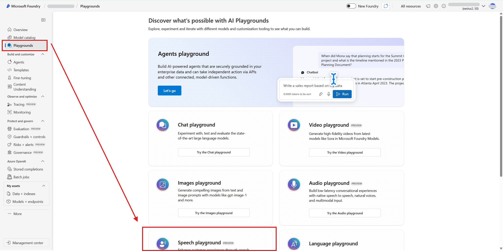
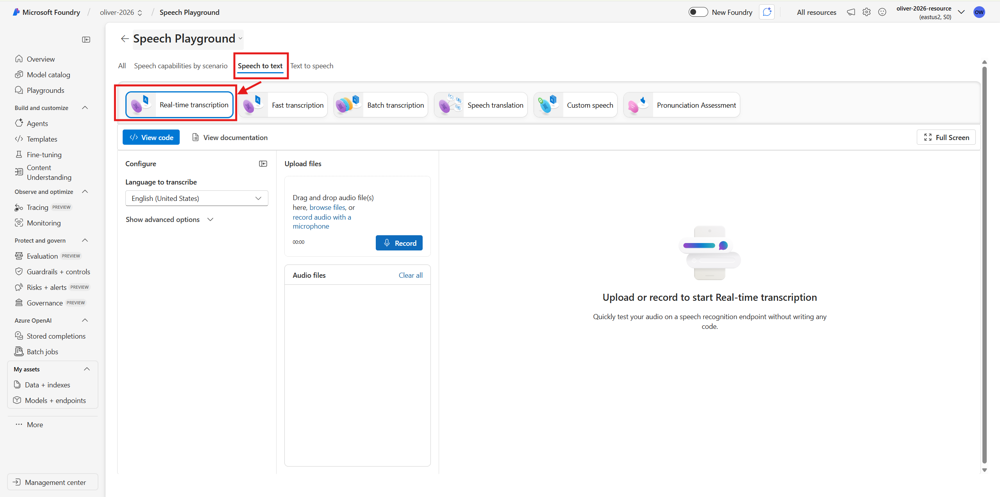
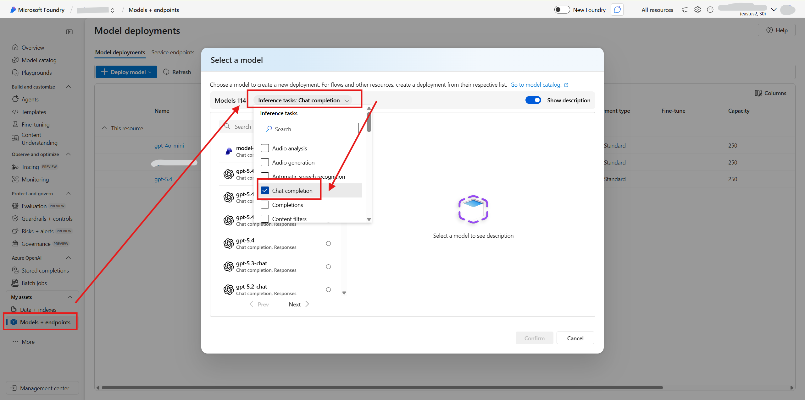

# VoiceRefine

**Real-time speech capture with AI-powered summary and smart form auto-fill**

VoiceRefine is an open-source demo that transcribes your microphone live, generates a running summary, and auto-fills structured fields — speaker, topic, key points, action items, and more — as you speak. You bring your own Azure credentials and run everything locally. Nothing is stored anywhere — no database, no server logs of your content, no cloud relay.

> 📖 **For students and educators:** See [LEARN.md](LEARN.md) for a concept-by-concept walkthrough of how this project works, why each design decision was made, and exercises to extend it.

> ⚠️ **Security reminder — please read before you start**
>
> Your `.env` file contains API keys that grant direct access to your Azure account and will incur costs if misused. **Never commit `.env` to Git, never share it publicly, and never paste your keys into chat or forums.** Add `.env` to your `.gitignore` before doing anything else.

---

## How it works

```
Microphone / Text Input
        ↓
frontend/index.html        (runs in your browser — no server needed)
        ↓  WebSocket
backend/app.py             (runs on your machine — Python / FastAPI)
        ↓
Azure Speech Services  →  live transcription
        ↓
Azure OpenAI / AI Foundry  →  live summary + structured extraction
        ↓
Smart Capture panel in the browser
        ↓
Download session as TXT
```

---

## Features

- Live speech transcription via Azure Speech Services
- Real-time evolving summary of the conversation
- Smart auto-fill for: speaker name, topic, category, priority, key points, action items, notes
- Transcript history panel with expandable modal
- Text mode — paste or type instead of speaking
- Download the full session as a TXT report
- Light / dark mode
- **No database** — nothing is stored anywhere outside your own machine

---

## Use cases

| Scenario | What VoiceRefine does |
|---|---|
| Job interview | Captures candidate answers and extracts structured notes in real time |
| Team meeting | Tracks discussion and surfaces action items automatically |
| Client discovery call | Summarises the conversation live while you focus on listening |
| Lecture / presentation | Organises spoken content into structured fields for review |

---

## Prerequisites

- Python 3.10 or later
- An Azure account with:
  - **Azure AI Speech** resource (for live transcription)
  - **Azure OpenAI** resource with a chat model deployed (for summary and extraction)
- A modern browser (Chrome or Edge recommended for microphone access over `localhost`)

---

## Setup

### 1 — Clone the repository

```bash
git clone https://github.com/your-username/realtime-speech-to-text.git
cd realtime-speech-to-text
```

> Before anything else, make sure `.env` is in your `.gitignore`:
>
> ```
> echo ".env" >> .gitignore
> ```

---

### 2 — Create your Azure services and get your keys

You need two Azure resources.

#### Azure AI Speech

1. Go to [Azure AI Foundry](https://ai.azure.com) and open your project.
2. In the left sidebar, click **Playgrounds**, then scroll down and select **Speech playground**.



3. Select the **Speech to text** tab, then click **Real-time transcription** to confirm your speech resource is active.



4. Note the resource name shown in the top-right (e.g. `oliver-2026-resource (eastus2)`). Go to that resource in the [Azure portal](https://portal.azure.com) → **Keys and Endpoint** to copy **Key 1** and the **Region**.

#### Azure OpenAI / AI Foundry

1. In AI Foundry, go to **My assets → Models + endpoints** in the left sidebar.
2. Click **+ Deploy model**, then in the dialog filter by **Inference tasks: Chat completion** to find GPT models.
3. Select a model (e.g. `gpt-4o`) and deploy it — note the **deployment name** you give it.



4. Go to the resource in the [Azure portal](https://portal.azure.com) → **Keys and Endpoint** to copy the **Endpoint URL** and **Key**.

---

### 3 — Configure the backend environment

Create `backend/.env` and fill in your values:

```dotenv
SPEECH_REGION=eastus2
SPEECH_KEY=your_speech_key_here

AZURE_OPENAI_ENDPOINT=https://your-resource.cognitiveservices.azure.com/
AZURE_OPENAI_API_KEY=your_openai_key_here
AZURE_AI_DEPLOYMENT=gpt-4o

# Leave this blank — it will be filled automatically in the next step
ACCESS_TOKEN=
```

> ⚠️ Never share this file or commit it to version control.

---

### 4 — Generate your access token

The access token prevents anyone else on your network from connecting to your backend. Run this **once**:

```bash
cd backend
python secret.py
```

It writes the token into `backend/.env` automatically and prints it:

```
✅ ACCESS_TOKEN updated in .env

Your access token:

    ph0fS5HZ_N5vrfFWM64QeNS_d_P9rKsLNxk_4r4FsqCsAmE9iJ21V5dKPUHTPd0D

Keep this secret. Enter it in the frontend settings panel to connect.
```

Copy this token — you will paste it into the frontend in Step 6. To rotate it at any time, just run `python secret.py` again.

---

### 5 — Install dependencies and run the backend

```bash
cd backend

# Create and activate a virtual environment
python -m venv .venv

# Windows
.venv\Scripts\activate

# macOS / Linux
source .venv/bin/activate

# Install dependencies
pip install -r requirements.txt

# Start the server
uvicorn app:app --host 0.0.0.0 --port 8000
```

You should see:

```
✅ Azure OpenAI client initialized
🚀 VoiceRefine API server started
INFO:     Uvicorn running on http://0.0.0.0:8000
```

Leave this terminal open while you use the app.

---

### 6 — Open the frontend and connect

1. Open `frontend/index.html` directly in your browser — no web server needed.
2. Click the **Settings** panel.
3. Set **Server URL** to `ws://localhost:8000/ws/speech`.
4. Paste your access token from Step 4 into the **Access Token** field.
5. Click **Connect**.

<!-- Add a screenshot of the Settings panel here when available -->

The status bar turns green and shows **Connected to server** when authentication succeeds.

---

### 7 — Start using VoiceRefine

- **Speech mode** — click the microphone button and speak. Transcription, summary, and form fields update in real time.
- **Text mode** — paste or type text and click **Refine** to run extraction without a microphone.
- Click **Download Report** to save the session as a TXT file when done.

<!-- Add a screenshot of the main UI here when available -->

---

## Privacy and data

- **No database.** Nothing you say or type is stored on any server. Processing happens entirely within your own Azure subscription.
- **No relay.** The frontend connects directly to your local backend — there is no third-party service in the middle.
- **Your token stays on your machine.** The access token lives only in your `.env` file and is never sent to any external service.
- **Your Azure keys are yours.** This project does not collect, transmit, or log your credentials anywhere.

Feel free to use the demo knowing your data stays entirely under your own control.

---

## Tech stack

| Layer | Technology |
|---|---|
| Backend | Python, FastAPI, Uvicorn, Pydantic |
| Real-time | WebSockets |
| Speech | Azure Cognitive Services Speech SDK |
| AI | Azure OpenAI / Azure AI Foundry |
| Frontend | HTML, CSS, Vanilla JavaScript |

---

## Troubleshooting

**"Authentication failed" in the browser**
The token in the frontend does not match `backend/.env`. Re-run `python secret.py`, copy the printed token, and paste it into the Settings panel.

**"Speech service not configured on server"**
`SPEECH_KEY` or `SPEECH_REGION` is missing or wrong in `backend/.env`. Fix it and restart the backend.

**Microphone not working**
Browsers block microphone access on non-secure origins. Use `localhost` (not an IP like `192.168.x.x`) or serve the frontend over HTTPS.

**Connection refused**
Make sure the backend is running (`uvicorn app:app --port 8000`) and the Server URL in the Settings panel matches exactly.
